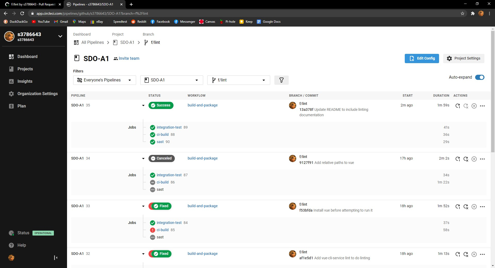
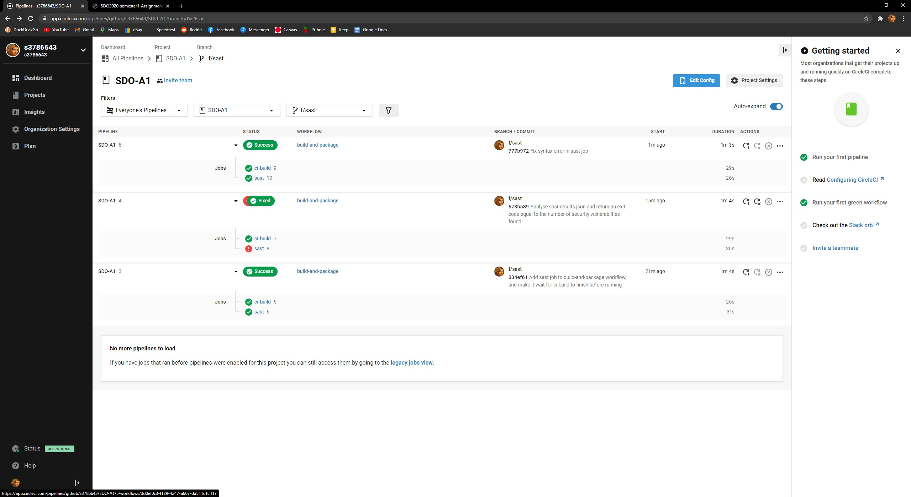
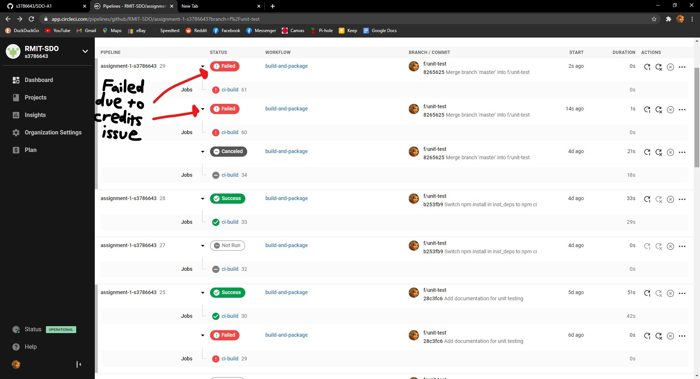
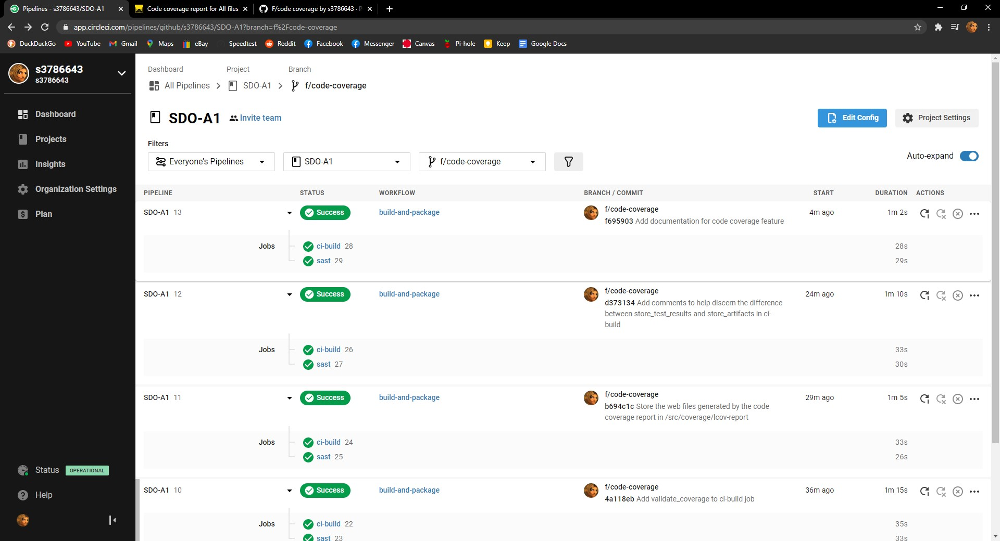
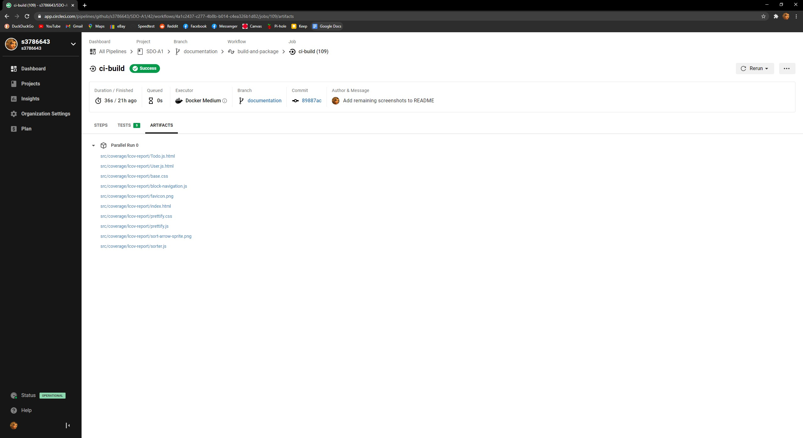
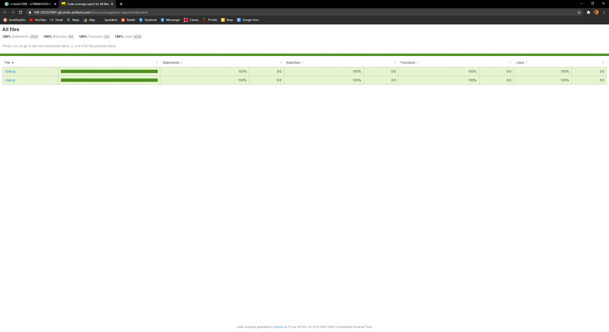
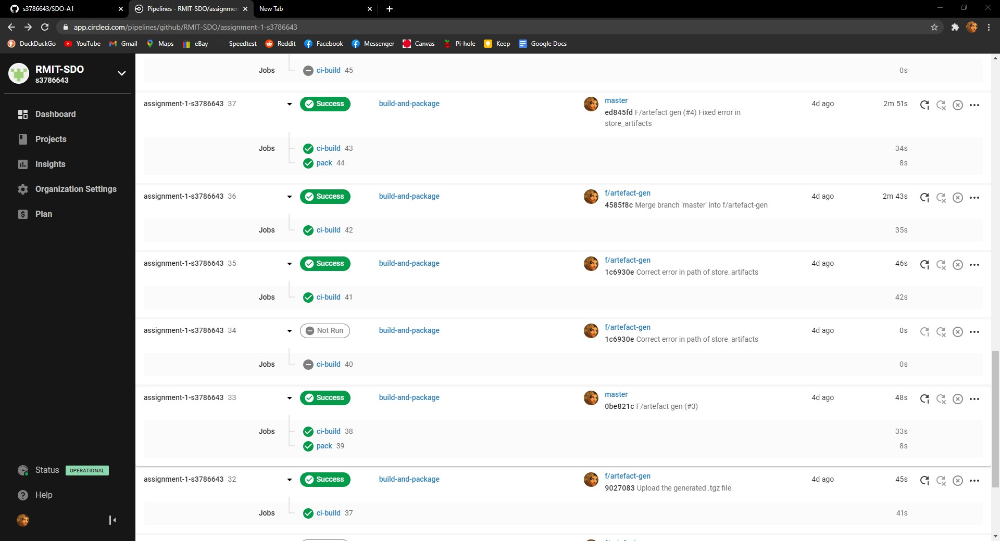
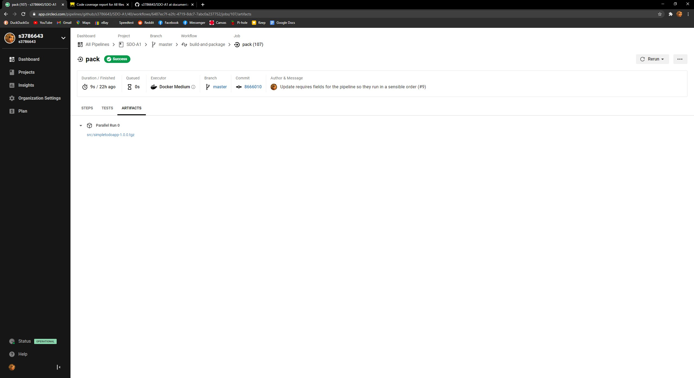
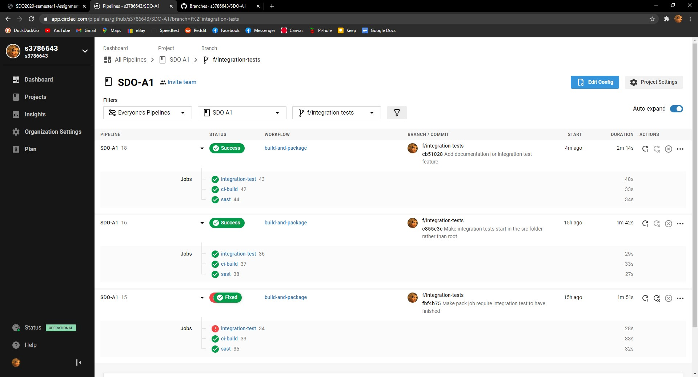

# Simple Todo App with MongoDB, Express.js and Node.js
The ToDo app uses the following technologies and javascript libraries:
* MongoDB
* Express.js
* Node.js
* express-handlebars
* method-override
* connect-flash
* express-session
* mongoose
* bcryptjs
* passport
* docker & docker-compose

## What are the features?
You can register with your email address, and you can create ToDo items. You can list ToDos, edit and delete them. 

# How to use
First install the depdencies by running the following from the root directory:

```
npm install --prefix src/
```

To run this application locally you need to have an insatnce of MongoDB running. A docker-compose file has been provided in the root director that will run an insatnce of MongoDB in docker. TO start the MongoDB from the root direction run the following command:

```
docker-compose up -d
```

Then to start the application issue the following command from the root directory:
```
npm run start --prefix src/
```

The application can then be accessed through the browser of your choise on the following:

```
localhost:5000
```

## Testing

Basic testing has been included as part of this application. This includes unit testing (Models Only), Integration Testing & E2E Testing.

### Static Code Analysis - Linting:
#### The Problem
Bugs getting into a production environment can create serious issues. Also, code readability is important for anyone attempting to understand another programmers work.

#### The Solution
Linting is helpful because it can find potential errors very quickly. These errors may include unreachable code or an attempt to access an array index that is out of bounds.
It also can detect stylistic issues, where the code works as expected, but is written in a way that is difficult to understand.
Linting is conducted as part of the ci-build job, as it is very quick to run, which means if an error is found we will know almost immediately.
ci-build runs 'npm run test-lint --prefix src/' after it has installed the dependencies it needs.

#### Linting Tests passing



### Static Code Analysis - SAST

#### The Problem
Security bugs can cause serious problems if they are introduced to the master branch. Additionally, if tests need to be run manually, they can be forgotten.

#### The Solution
Static Application Security Testing is run through the 'sast' job defined in .circleci/config.yml
After ci-build has finished, sast installs python3-pip and uses that to install nodejsscan, the tool being used to generate a security report.

Nodejsscan creates a sast-output.json file, which contains information on the files nodejsscan has scanned and most importantly, the number of security issues it found.

The sast job then uses jquery to read sast-output-json and return an exit code equal to the number of security issues. An exit code of 0 (no issues), is good. A code other than 0 will cancel the workflow.

#### SAST Tests passing


### Unit Testing
Unit testing is important, as it allows us to identify bugs in the code we have written. However, if they have to be run
manually, it is possible that someone may forget to run them, thus letting a bug into production code. If they are run automatically, there is no chance that they will be forgotten.

#### The Problem
Bugs can be introduced in the models used in the application, such as a User or Todo.

#### The Solution
Automated unit testing is accomplished within the ci-build job defined in .circleci/config.yml
ci-build is triggered by the build-and-package workflow, which runs whenever a change is made to master or a pull request is made.
ci-build first does some preliminary tasks; installing dependencies and running the 'checkout' command. Then, it automatically runs the following command:
npm run test-unit --prefix src/ -- --coverage
This generates a junit.xml file containing the results of the tests. This file is stored within the folder specified with JEST_JUNIT_OUTPUT_DIR, and uploaded to circleci using store_test_results
Circleci will warn against merging a pull request if a test has failed.

#### Unit Tests passing


### Code Coverage
#### The Problem
Bugs being introduced into the application's code could be a symptom of neglecting test writing.
Code Coverage can detect if we are neglecting our test writing as new features are developed.

#### The Solution
It works through the '-- --coverage' argument found in 'Run unit tests' in ci-build. This argument causes jest to save a code coverage report as it conducts its tests. The report is saved in the ARTIFACTS tab through store_artifacts in ci-build.
The code coverage report can be found within the artifacts tab of the ci-build job. It can be viewed by clicking the artefact "src/coverage/lcov-report/index.html". It will then present you with a table showing code coverage.


#### Code Coverage tests passing


##### Code Coverage saving on circleci


##### Code Coverage report


### Artefact Generation
#### The Problem
Having only one person manually build and deploy the application creates a single point of failure.
It can also take a long period of time to build a deployable version of the application.

#### The Solution
Artefact generation is automated with the 'pack' job defined in .circleci/config.yml, it executes after ci-build has finished, using 'requires'. It also only activates on the master branch because of the filter applied. This is to prevent needlessly building the application on test branches.
Having a way to automatically build the application means anyone can do it if required, alleviating the single point of failure.

#### Artefact Generation tests passing (pack only runs on master)


#### Artefact Generation saves artefacts


### Integration Testing
#### The Problem
Although code may appear to function correctly when run in isolation, there may be a bug in the way different aspects of the code interact with each other.

When run manually, integration tests can take quite a bit of time, and also require you to remember to create a fresh MongoDB instance prior to issuing the test command. Automating the tests reduces the rate of conducting the test incorrectly and can save time.

#### The Solution
It works through the 'integration-test' job defined in .circleci/config.yml.
The job creates two docker images, the first is the standard node image used in the other jobs. The second is a MongoDB instance that allows the tests to function correctly.
The job sets the variable 'JEST_JUNIT_OUTPUT_DIR' to 'test-output', making the results of the tests save to a folder named 'test-output'.

The job then automatically runs 'npm run test-integration --prefix src/', which runs the integration tests and saves the results. The results are then saved on circleci using store_test_results.

Additionally, because circleci creates a new, empty database every time, there isn't a risk of a previous test leaving traces in the database that affects future tests.

#### Integration Tests passing


### E2E Tests
E2E Tests are included to ensure that the website operates as it should from the users perspective. E2E Tests are executed in docker containers. To run E2E Tests execute the following commands:

```
chmod +x scripts/e2e-ci.sh
./scripts/e2e-ci.sh
```


###### This project is licensed under the MIT Open Source License
